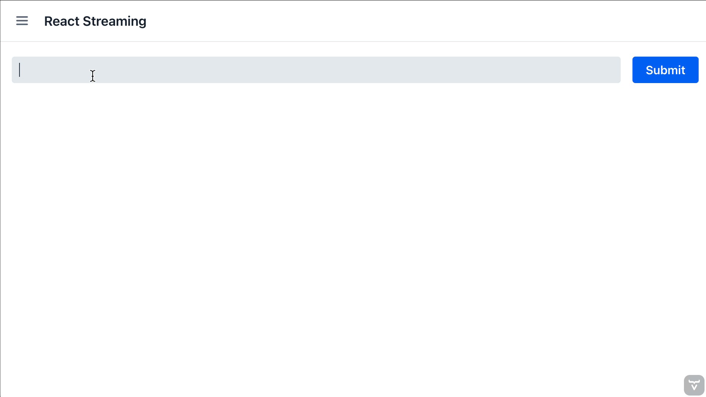

# Rendering Streaming AI Markdown Responses

This repository demonstrates how to efficiently stream and render AI-generated Markdown content in both React and Java-based UIs using Spring AI. It shows how to:

- Generate streaming responses from LLMs using Spring AI
- Display live-updating Markdown content in React applications
- Create a custom Vaadin component for efficient Markdown streaming in Java
- Handle token buffering and state synchronization

## Features

- Spring AI integration with OpenAI
- React implementation using react-markdown
- Custom Vaadin Flow component with React adapter
- Efficient token streaming and buffering
- Complete examples for both React and Java approaches

## Prerequisites

- Java 21

## Quick Start

1. Clone the repository
2. Configure your OpenAI API key in `application.properties`
3. Run `Application.java` in your IDE or `./mvnw` in the terminal
4. Open `http://localhost:8080` in your browser

## Documentation

For a detailed explanation of the implementation and best practices, check out the full blog post:
[Streaming AI Responses to the Browser][blog-post]

## License

MIT License

[blog-post]: https://vaadin.com/blog/streaming-ai-responses-to-the-browser
